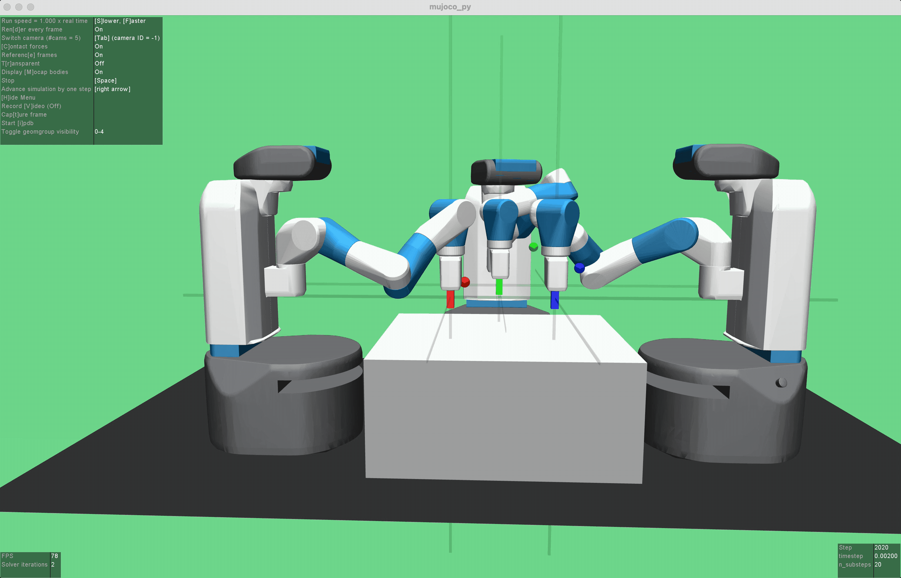

# Multi-Agent Robot Environment

This project provides a reinforcement learning training environment based on Mujoco for multiple agents in cooperative or competitive tasks. The environment consists of a robot and multiple target objects, where the robot needs to move to the target object to obtain rewards while avoiding collisions with other robots.

## Installation

1. Install Mujoco by following the instructions on the [Mujoco website](http://www.mujoco.org/).
2. Clone this repository to your local machine:
```bash
$ git clone https://github.com/your_username/multi_agent_robot_env.git
$ cd multi_agent_robot_env
```

3. Install the dependencies:
```bash
$ pip install -r requirements.txt
```

4. Run the test code:
````bash
$ python test.py
```

## Usage

In the `examples` directory, you can find sample code for training a single agent, multiple agents in cooperative training, and multiple agents in competitive training. You can use these examples as references for training reinforcement learning in this environment.

## Project Structure
```tree
├── README.md
├── requirements.txt
├── env
│ ├── init.py
│ ├── multi_agent_robot_env.py
│ └── mujoco_config.xml
├── examples
│ ├── single_agent.py
│ ├── multi_agent_coop.py
│ └── multi_agent_comp.py
├── tests
│ ├── init.py
│ └── test_env.py
└── data
├── input
└── output
```


  

 

 

## Contributing

If you find any bugs or have suggestions for improvements, please submit an issue on GitHub or create a pull request.

## License

This project is licensed under the [MIT License](LICENSE).
